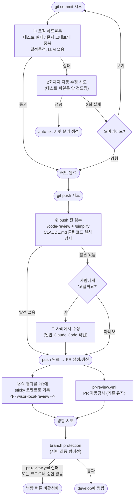
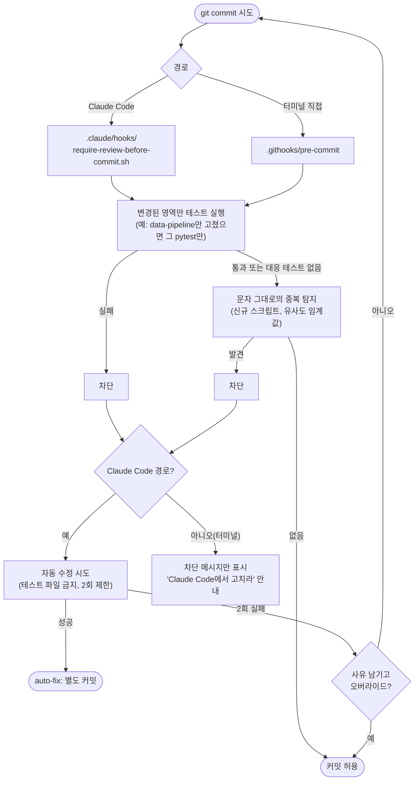
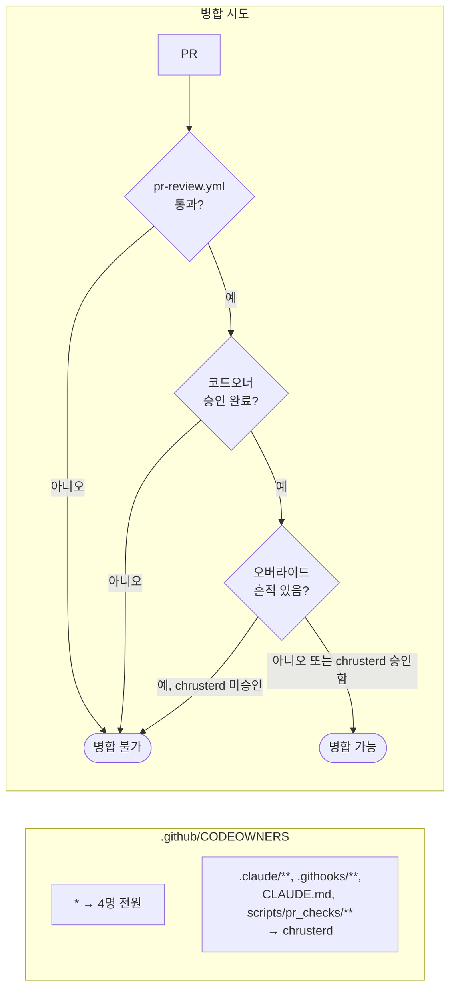
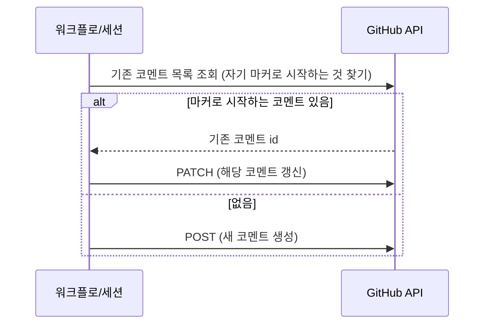

# 클린 코드 검수 시스템 — 시스템설계도

작성일 2026-08-18 (2026-08-13 작성 원본을 대체)
관련 기획: [`01-기획서.md`](./01-기획서.md) · 관련 기술 설계: [`2026-08-18-precommit-clean-code-gate-design.md`](../superpowers/specs/2026-08-18-precommit-clean-code-gate-design.md)
실제 구현 근거: `.githooks/pre-commit`, `.claude/hooks/require-review-before-commit.sh`, `scripts/pr_checks/*.py`, `.github/workflows/pr-review.yml`, `.github/CODEOWNERS`

---

## 1. 전체 아키텍처

2026-08-11 설계는 PR 이벤트 이후만 다뤘다. 이번 설계는 그 앞에 로컬 게이트 두 단계를 추가하고, 맨 끝(병합 시도)에 서버 강제를 추가한다 — **PR 이벤트 이후 레이어는 손대지 않는다**(레이어 3 `claude-quality-review.yml`만 폐기).



### 레이어별 요약

| 레이어 | 위치 | 판단 근거 | 병합 차단 | 비용 |
|---|---|---|---|---|
| ① 로컬 하드블록 | 커밋마다, 로컬 | 테스트 실패 / 문자 그대로의 중복 (결정론적) | (병합 전 단계, 커밋 자체를 막음) | 무료 |
| ② push 전 검수 | push마다, 로컬 | CLAUDE.md 전체 — 클린코드 원칙 + 도메인 규칙(매수·매도 금지, 문장 규칙 등) + 일반 품질 (`/code-review`+`/simplify`) | 아니오, 사람 승인 후에만 수정 | 구독 사용량 (push당 1회) |
| PR 자동검사 | `pr-review.yml` | 스크립트·빌드·테스트 전체 (규칙 기반) | **예** (branch protection 필수 상태 검사) | 무료 |
| 서버 최종 방어선 | branch protection | 위 자동검사 통과 + 코드오너 승인 | **예** | 무료 |

~~레이어 2(Claude 규칙 리뷰, `claude-rules-review.yml`)~~와 ~~레이어 3(Claude 학습 코드 품질 리뷰, `claude-quality-review.yml`)~~ **둘 다 폐기했다** — ②가 CLAUDE.md 전체(도메인 규칙 포함)를 감사 근거로 삼으므로 두 레이어의 판단 영역을 흡수한다. 남겨두면 순수 중복이었다.

**받아들인 리스크**: ②는 로컬 세션에서만 돈다 — `claude-rules-review.yml`처럼 GitHub 이벤트에 무조건 걸리는 서버 트리거가 없어서, 터미널 직접 push나 세션 중단 시 아예 안 돌 수 있다. 저장소 커밋 기록으로도 "Claude Code를 거쳤는지" 사후 확인이 원래 불가능했다는 점(공동저자 트레일러 관행 없음)을 근거로 chrusterd가 이 리스크를 수용했다.

---

## 2. ① 로컬 하드블록 내부 단계

`git commit` 직전에 **두 경로**로 걸린다 — Claude Code로 커밋하면 `PreToolUse` 훅이, 터미널에서 직접 커밋해도 git 네이티브 훅(`.githooks/pre-commit`, `core.hooksPath`로 지정)이 똑같이 걸린다. 의존성 추가 없이 git 내장 기능 + Python 표준 라이브러리로만 구현한다.



- **테스트 부재는 통과시킨다** — 대응하는 테스트가 아예 없으면 막지 않는다. "충분한 테스트가 있는가"는 사람이 PR 체크리스트에서 판단할 몫이지, 로컬 게이트가 강제할 몫이 아니다.
- **자동 수정은 별도 커밋으로 분리한다**(`auto-fix: <설명>`) — 원래 커밋에 합치지 않아, 나중에 "이 줄이 사람이 짠 건지 자동수정된 건지" 추적할 수 있다.
- **오버라이드하면 다음 push 시 PR에 흔적을 남긴다.** 정상 통과·정상 자동수정은 아무 흔적도 안 남긴다 — 흔적은 "위험 신호"에만 예외적으로 붙여서 신호 대 잡음비를 지킨다.

---

## 3. ② push 전 검수 흐름

`git push` 시도 시 세션이 자동으로 개입한다. **커밋마다가 아니라 push당 1번**만 돈다 — 커밋은 로컬에서 자주, push는 그보다 드물게 하므로 무거운 LLM 리뷰의 실행 빈도를 실질적으로 낮춘다.

```mermaid
sequenceDiagram
    participant U as 팀원
    participant C as Claude Code 세션
    participant GH as GitHub (PR)

    U->>C: git push 시도
    C->>C: 이번 push로 나갈 커밋 전체 diff에<br/>/code-review 실행
    C->>C: 이어서 /simplify 실행
    Note over C: 둘 다 루트 CLAUDE.md 전체를 감사 근거로 씀<br/>(클린코드 원칙 + 도메인 규칙 + 일반 품질)

    alt 발견 사항 있음
        C->>U: "이 부분은 파급범위가 커 보입니다.<br/>고칠까요?"
        alt 승인
            U->>C: 예
            C->>C: 그 자리에서 수정<br/>(일반 작업, 재검증 안전장치 불필요 —<br/>사람이 매번 확인했으므로)
        else 거절
            U->>C: 아니오
        end
    end

    C->>GH: push 실행 (PR 생성 또는 갱신)
    C->>GH: 방금 로컬에서 나온 리뷰 결과를<br/>sticky 코멘트로 게시<br/>(재실행 아님, 결과 재활용)
    Note over GH: &lt;!-- wisor-local-review --&gt;<br/>발견 없어도 "위반 없음" 명시
```

수정으로 새 커밋이 생기면 ①을 다시 거치지만(가벼우므로 문제없음), **② 전체를 다시 돌리지는 않는다** — 사람이 그 자리에서 이미 승인했으므로 재확인이 불필요하다.

---

## 4. 서버 최종 방어선

로컬 게이트는 `git commit --no-verify`로 우회 가능하다 — 클라이언트 설정만으로는 원천 차단이 안 된다. 그래서 강제력은 서버에 둔다.



- `pr-review.yml`은 이미 실패 신호를 내고 있었다(2026-08-11 설계부터). **branch protection에 필수 상태 검사로 등록만 하면 된다** — 새로 만드는 게 없다.
- 경로 기반 게이트키퍼(`.claude/**` 등)는 GitHub 기본 CODEOWNERS 기능으로 해결한다 — 커스텀 스크립트 불필요.
- 오버라이드 흔적은 경로로 못 잡으므로, `pr-review.yml`에 "PR에 오버라이드 마커가 있으면 chrusterd를 리뷰어로 지정" 하는 작은 스텝을 추가한다.
- 평소 PR은 4명 상호 승인(승인 1명 이상) — 지금은 승인 0명이어도 병합 가능한 상태였으므로, 이건 기존 관행 유지가 아니라 새로 도입하는 규칙이다.

---

## 5. sticky 코멘트가 갱신되는 방식 (기존 유지)

`pr-review.yml`은 2026-08-11 설계 그대로 동작한다 — 자기 마커로 시작하는 기존 코멘트를 찾아 `PATCH`, 없으면 `POST`. 새로 추가되는 `<!-- wisor-local-review -->`(②의 결과)도 같은 패턴을 따른다.



같은 PR에 여러 번 push해도 마커별로 코멘트는 항상 1개씩 유지된다: `wisor-auto-checks` · `wisor-local-review`(신규, ②) — 총 2개. (`wisor-claude-rules`·`wisor-claude-quality`는 두 레이어 폐기와 함께 더 이상 안 남는다.)

---

## 6. 불필요한 재실행·재검토 방지 (2026-08-11 설계에서 계승)

`paths-ignore: ['docs/**']`, `reviewed-sha` 대조를 통한 reopened 스킵은 `pr-review.yml`에 그대로 남아 있다 — 이번 설계로 바뀐 게 없다. `synchronize` 시 diff 범위 좁히기는 원래 레이어 2·3(Claude 리뷰)에만 해당하던 최적화였는데, 그 레이어들이 폐기되면서 이제 해당사항이 없다. 자세한 동작은 `git log`에서 이 문서의 2026-08-13 버전(5장)을 참고.

②는 이 최적화 대상이 아니다 — push당 1번만 돌고, 애초에 diff 범위를 좁혀야 할 만큼 반복 실행되지 않는다.
