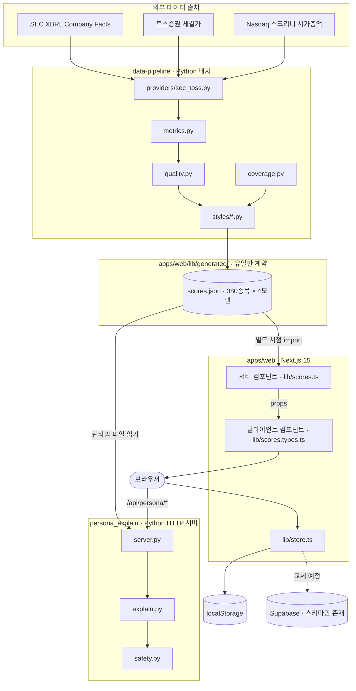
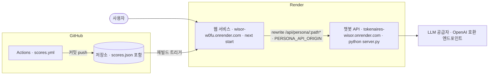
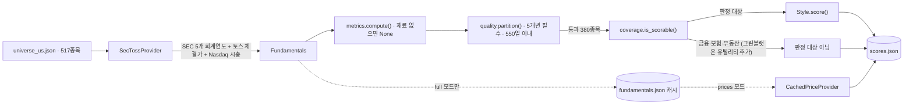
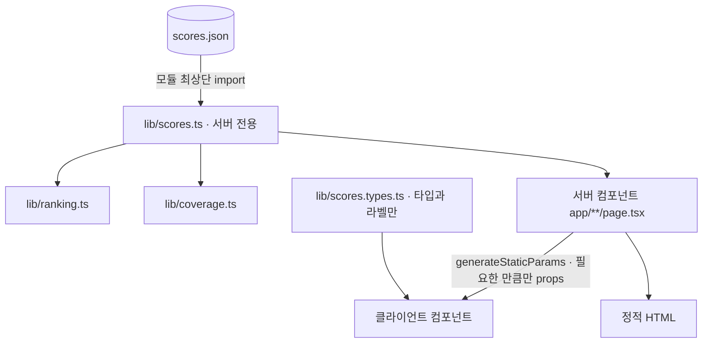
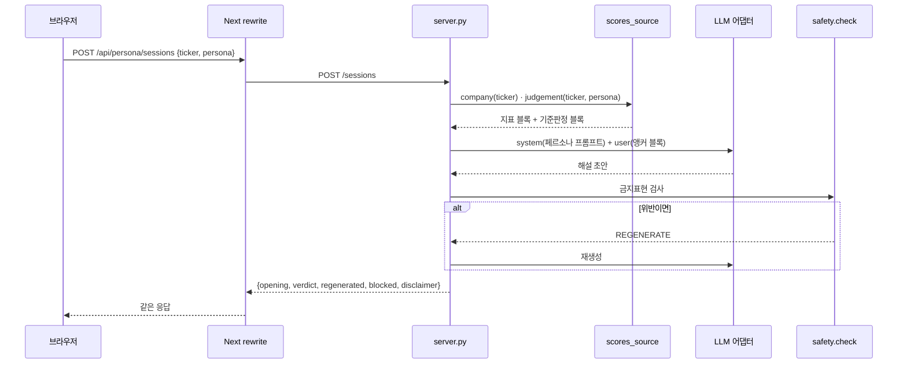
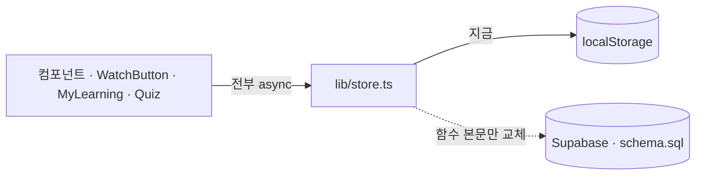
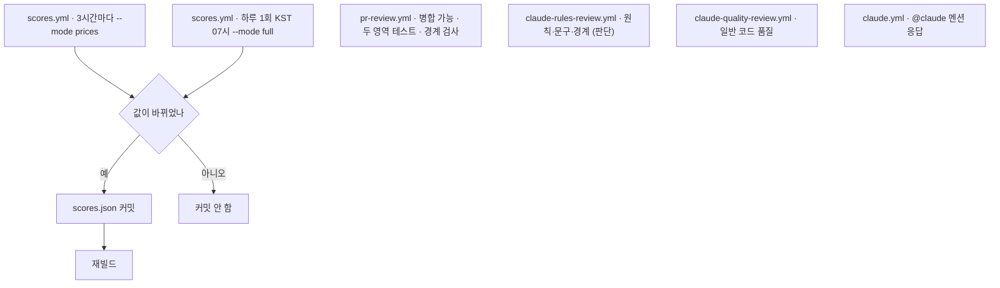

# 시스템 설계도 — Wisor

> 기준 시점 2026-08-18 · 저장소 실제 코드에서 확인한 구조입니다.
> 제품 의도와 규칙은 루트 `CLAUDE.md`, 영역별 상세는 각 디렉터리의 `CLAUDE.md`에 있습니다.
> 이 문서는 **무엇이 어디서 돌고, 무엇이 무엇에 의존하는가**만 다룹니다.

---

## 0. 한 문장 요약

Wisor는 **파이썬 배치가 만든 JSON 하나를 Next.js가 빌드 시점에 정적으로 구워내는 시스템**이고,
런타임에 살아 움직이는 부분은 해설 챗봇 API 하나뿐입니다.

이 한 문장이 아래 모든 설계 판단의 이유입니다. 재무데이터가 브라우저로 나가지 않는 것도,
점수가 바뀌려면 커밋이 필요한 것도, 사용자 데이터가 아직 브라우저에만 있는 것도 여기서 나옵니다.

---

## 1. 전체 구조



---

## 2. 구성 요소

| 구성 요소 | 런타임 | 위치 | 하는 일 | 담당 |
|---|---|---|---|---|
| 웹 | Node.js 23+ / Next.js 15 App Router | `apps/web/` | 화면 전체. 페이지가 전부 정적 생성 | 1번 |
| 점수 배치 | Python 3.11+ | `data-pipeline/` | 재무 원천 → 지표 → 스타일 점수 → `scores.json` | 3번 |
| 해설 챗봇 API | Python 3.11+ (표준 라이브러리 `ThreadingHTTPServer`) | `persona_explain/` | 대가 페르소나로 지표 해설. 세션은 메모리 | — |
| 사용자 데이터 | 브라우저 localStorage | `apps/web/lib/store.ts` | 학습 진도·퀴즈·관심종목·학습노트 | 2번 |
| 사용자 DB | PostgreSQL (Supabase) | `supabase/schema.sql` | **스키마만 작성. 앱 연결 미착수** | 2번 |
| PR 자동검사 | GitHub Actions | `.github/workflows/`, `scripts/pr_checks/` | 경계 검사·형식 검사·Claude 리뷰 2종 | 2번 |

의존성은 웹이 `next`·`react`·`react-dom` 셋뿐이고, 배치는 표준 라이브러리 + `pytest`뿐입니다.
챗봇 서버는 HTTP 프레임워크를 쓰지 않지만 무의존은 아닙니다 —
`persona_explain/requirements.txt`에 `openai`·`python-dotenv`가 있고,
**실제 LLM 호출에만 필요합니다.** Mock 어댑터로만 돌리면 표준 라이브러리로 충분합니다.
**의존성 추가는 사전 합의 사항입니다.**

---

## 3. 배포 토폴로지



두 서비스를 나눈 이유는 **런타임이 다르기 때문**입니다. 웹은 Node, 챗봇은 Python이라
한 서비스에 넣으려면 두 런타임을 담은 Dockerfile과 프로세스 매니저가 필요합니다.

브라우저는 챗봇 서버 주소를 모릅니다. `/api/persona`만 보고, Next의 rewrite가
`PERSONA_API_ORIGIN`으로 넘깁니다(`apps/web/next.config.mjs`).
이 값은 서버 환경변수라 브라우저에 노출되지 않습니다.

콜드스타트는 예열로 다룹니다. `apps/web/components/PersonaChatFab.tsx`가
마운트 시 `getHealth()`를 한 번 던져, 사용자가 버튼을 누르기 전에 서버가 깨어나도록 합니다.

배포 설정은 루트 `render.yaml`에 두 서비스로 적혀 있고, 환경변수와 주의사항은
[배포 문서](./deploy.md)에 있습니다. 이전 배포처였던 `netlify.toml`은 삭제했습니다.

> ⚠️ `render.yaml`은 저장소에 있기만 해서는 **아무 일도 하지 않습니다.** 지금 도는 두
> 서비스는 Render UI에서 손으로 만들었고, Blueprint는 사람이 명시적으로 동기화할 때만
> 적용됩니다. **Blueprint는 서비스를 이름으로 찾으므로**, 동기화 전에
> [배포 문서](./deploy.md)의 "Blueprint로 동기화하기 전에"에서 이름을 대조하세요.

---

## 4. 데이터 흐름

### 4.1 재무 → 점수 (배치)



**두 주기로 도는 이유.** 재무는 분기에 한 번 바뀌고 가격은 3시간마다 바뀝니다.
가격 갱신마다 SEC를 부르면 종목당 두 번씩 380종목, 하루 여덟 번이면 6천 회가 넘습니다.

| 모드 | 주기 | 부르는 곳 | 남기는 것 |
|---|---|---|---|
| `--mode full` | 하루 1회 (KST 07시) | SEC + 토스 + Nasdaq | `fundamentals.json` 캐시 갱신 |
| `--mode prices` | 3시간마다 | 토스만 | 캐시를 읽어 체결가만 덮어씀 |

**캐시가 없으면 `prices`는 실패합니다.** 조용히 전체 수집으로 되돌아가지 않습니다.
3시간짜리 작업이 어느 날 갑자기 SEC를 760번 두드리는 쪽이 더 위험하기 때문입니다.

**점수 계산식** (버핏·그레이엄·린치 — `method: "threshold"`)

```
점수 = 충족 기준의 가중치 합 ÷ 판정한 기준의 가중치 합 × 100
```

그린블랫만 구조가 다릅니다(`method: "rank"`). 마법공식 원식대로 최신
`EBIT / (유동자산 − 유동부채 + 순유형자산)`과 `EBIT / 기업가치`를 각각 유니버스 안에서
내림차순 순위 매긴 뒤 두 순위를 합산합니다.

정성 판단이 핵심인 피셔·막스·소로스는 **점수화하지 않습니다.** 공개 재무지표로 근사하면
철학을 왜곡하므로 학습 화면의 자가진단 체크리스트로만 다룹니다.

### 4.2 점수 → 화면 (빌드 시점)



`apps/web/lib/scores.ts`는 모듈 최상단에서 `scores.json`을 통째로 가져옵니다.
**클라이언트 컴포넌트가 이 파일을 import하면 380종목 재무데이터 전부가 브라우저 번들에 실립니다.**

그래서 경계가 둘로 갈립니다.

- 타입과 라벨 → `apps/web/lib/scores.types.ts` (클라이언트 안전)
- 데이터 → 서버 컴포넌트가 필요한 만큼만 props로 (`apps/web/app/me/page.tsx`가 예시)

**scores.json이 바뀌어도 커밋 없이는 배포된 화면이 바뀌지 않습니다.** 빌드 시점에 번들로
들어가기 때문입니다. `scores.yml`이 값이 같으면 빈 커밋을 만들지 않는 이유가 이것입니다.

### 4.3 해설 챗봇 (런타임에 동적인 유일한 경로)



설계상 중요한 세 가지.

1. **브라우저는 숫자를 보내지 않습니다.** `ticker`와 `persona`만 보냅니다.
   지표는 서버가 자기 `scores.json`에서 꺼냅니다 — 웹과 챗봇이 같은 파일을 각자 읽습니다.
   **다만 읽는 시점이 다릅니다.** 웹은 빌드 시점에 번들에 굽고, 챗봇은 런타임에
   `SCORES_JSON_PATH`(없으면 후보 경로 탐색)로 파일을 엽니다(`persona_explain/scores_source.py`).
   두 서비스를 따로 배포하므로 **같은 종목에 대해 서로 다른 기준일 값을 낼 수 있습니다.**
2. **지표·기준판정 블록은 앵커입니다.** 대화가 길어져도 잘리지 않습니다(`persona_explain/chat.py`).
3. **세션은 메모리입니다.** TTL 30분, 개수 상한 있음(`persona_explain/session_store.py`).
   서버가 재시작하면 사라집니다. 영속화 대상이 아니라고 판단한 것입니다.

LLM 어댑터는 OpenAI 호환 엔드포인트를 부르는 `OpenAIAdapter`와, 키 없이 도는
`MockAdapter` 둘입니다. 테스트는 Mock으로 돕니다.

### 4.4 사용자 데이터



**컴포넌트는 `localStorage`를 직접 부르지 않습니다.** 전부 `apps/web/lib/store.ts`를 거칩니다.

`store.ts`의 함수는 전부 `Promise`를 돌려줍니다. localStorage는 동기지만 Supabase는
비동기라서, 교체 시점에 모든 호출부를 열지 않도록 시그니처를 미리 맞춰 둔 것입니다.
**편의상 동기로 되돌리면 그 준비가 무너집니다.**

`supabase/schema.sql`에 저장하는 것과 저장하지 않는 것이 명시돼 있습니다 —
보유 수량·평가금액·증권사 정보는 스키마에 자리 자체가 없습니다.

---

## 5. 시스템의 유일한 계약 — `scores.json`

경계는 하나뿐입니다. **화면은 이 파일만 읽고, 재무 원천을 직접 만지지 않습니다.**

```
{
  "generatedAt": "2026-08-13T06:18:53+00:00",
  "dataSource": "sec-toss",              ← "sample"이면 화면에 예시 데이터 표시가 뜬다
  "asOf":     { "price": "2026-08-12", "financial": "2025-03-29" },
  "universe": { "indexes": [...], "requested": 517, "included": 380, "excluded": [...] },

  "styles": [                            ← 모델 메타. 화면이 기준 막대 칸 수를 여기서 안다
    { "id": "buffett", "modelVersion": "Buffett 1.0", "method": "threshold",
      "criteria": [ { "code": "BUF_ROIC_LEVEL", "label": "자본 효율성",
                      "weight": 3, "detail": "5년 평균 ROIC ≥ 12%" }, ... ] }
  ],

  "companies": [
    { "ticker": "A", "name": "...", "sector": "...", "price": 148.24, "marketCap": 41867.7,
      "asOf": { "price": "2026-08-12", "financial": "2025-10-31" },
      "metrics": { "roicAvg5y": 0.144, "fcfMargin": 0.166, ... },
      "scores": {
        "buffett": {
          "score": 72, "passed": 6, "totalJudged": 8, "total": 8,
          "dataConfidence": "높음",
          "criteria": [ { "code": "...", "status": "pass|fail|unknown",
                          "message": "관찰 문장", "weight": 3, "detail": "계산 기준" } ],
          "reasons": [...], "risks": [...]
        }
      } }
  ]
}
```

계약에서 특히 중요한 필드.

| 필드 | 왜 있는가 |
|---|---|
| `criteria[].code` | 학습노트에 그 시점 점수와 함께 **굳혀 저장**됩니다. 의미를 바꾸면 과거 노트가 거짓말이 됩니다 |
| `totalJudged` vs `total` | `unknown`이 분모에서 빠진 결과. 둘이 다르면 판정 못 한 기준이 있다는 뜻 |
| `dataConfidence` | `unknown`이 25%를 넘으면 점수 대신 '정보 부족' |
| `modelVersion` | 화면에 노출. 판정이 달라지는 변경이면 반드시 올립니다 |
| `asOf` | "현재"라고 쓰지 않기 위한 근거. 모든 점수 화면에 날짜가 함께 나갑니다 |
| `universe.excluded` | 무엇이 왜 빠졌는지. 배치 로그가 아니라 결과 파일에 남아야 화면이 설명할 수 있습니다 |

> ⚠️ **알려진 설계 부채:** `criteria[].message`는 Python이 완성한 한국어 문장입니다.
> 프론트가 문구를 못 고칩니다. 코드+값으로 분리하는 것이 남은 작업입니다.

---

## 6. 구조로 강제되는 규칙

원칙이 문서에만 있으면 지켜지지 않습니다. 네 가지는 실행되는 코드로 막습니다.

| 규칙 | 강제 지점 | 어기면 |
|---|---|---|
| **없는 값을 0으로 채우지 않는다** | `metrics.py`가 재료 없으면 `None`, `Criterion.test`가 `None`이면 `unknown`, 분모에서 제외 | `tests/test_scoring.py` 실패 |
| **재무데이터가 브라우저로 안 나간다** | `lib/scores.ts` 서버 전용 + `scripts/pr_checks/boundary_check.py` | 브라우저에서 모듈 평가 시 예외 · PR 자동검사 위반 |
| **사용자 문구에 권유가 없다** | `data-pipeline/wisor_data/styles/base.py`의 `BANNED_PHRASES` 검사 | **배치가 예외로 죽습니다.** 의도된 동작입니다 |
| **`scores.json`을 손으로 안 고친다** | `.claude/hooks/verify.sh` (PostToolUse) | 경고. 막지는 않음 |

`unknown`을 따로 두는 이유가 이 시스템에서 가장 중요합니다.
**데이터가 없는 것과 기준을 못 넘은 것은 사용자에게 전혀 다른 정보입니다.**
이걸 뭉개면 재무 공시가 늦은 기업이 구조적으로 불리해집니다.

---

## 7. 저장소 배치

```
wisor/
├─ apps/web/                    Next.js 15 · 화면 전체
│   ├─ app/                     라우트 (전부 정적 생성)
│   │   ├─ learn/               7명 대가 × 5장 · 비교 · 출처
│   │   ├─ screener/[style]/    4개 정량 모델 결과
│   │   ├─ stocks/[ticker]/     기업별 판정 + 학습노트
│   │   └─ me/                  내 학습
│   ├─ components/              15개가 "use client", 나머지는 서버
│   ├─ content/                 커리큘럼 (정적 TS · 빌드 시점 검증)
│   └─ lib/
│       ├─ generated/           ← 배치 산출물. 손대지 않음
│       ├─ scores.ts            서버 전용
│       ├─ scores.types.ts      클라이언트 안전
│       └─ store.ts             사용자 데이터 단일 통로
│
├─ data-pipeline/
│   ├─ wisor_data/providers/    공급자 인터페이스 · SecTossProvider
│   ├─ wisor_data/metrics.py    원천 → 파생 지표
│   ├─ wisor_data/coverage.py   '정보 부족'과 '판정 대상 아님'을 가름
│   ├─ wisor_data/quality.py    품질 게이트
│   ├─ wisor_data/styles/       base(프레임워크+금지어) + 4개 모델
│   └─ run_batch.py             전체 실행
│
├─ persona_explain/             해설 챗봇 (별도 배포)
├─ supabase/schema.sql          사용자 데이터 스키마 (미연결)
├─ scripts/pr_checks/           경계·형식 자동검사
└─ docs/                        설계·계획·출처·인계
```

커리큘럼 검증이 특이합니다. `apps/web/content/curriculum/index.ts`가
모듈 로드 시점에 `curriculumProblems()`를 돌려 문제가 있으면 `throw`합니다.
페이지가 전부 정적 생성이라 **이 검사는 빌드에서 돌고 건너뛸 수 없습니다.**

---

## 8. 자동화



세 리뷰 레이어 전부 **병합을 막지 않습니다.** 브랜치 보호에 연결하지 않았고,
사람이 코멘트를 보고 고칠지 정합니다. `docs/**`만 바뀐 PR은 `paths-ignore`로 건너뜁니다.

커밋 전 필수는 두 가지이고, **어느 영역을 고쳤든 전부 돌립니다.**

```bash
cd data-pipeline && python run_batch.py && pytest -q
cd apps/web && npm run build
```

---

## 9. 확장 지점

| 하려는 것 | 건드리는 곳 | 함께 봐야 하는 것 |
|---|---|---|
| Supabase 연결 | `lib/store.ts` **함수 본문만** | 시그니처는 이미 async. 호출부는 열지 않음 |
| 새 데이터 공급자 | `providers/base.py` 인터페이스 구현 | 5개 회계연도 필수 · `quality.partition()` 통과 · `asOf.priceAt` 기록 |
| 새 스타일 모델 | `styles/`에 파일 추가 + `run_batch.py`의 `STYLES` | 화면의 스크리너 탭 · 0.9로 시작해 검수 후 1.0 |
| 기준 추가·삭제 | `styles/*.py`의 `Criterion` | **기준 개수를 언급한 UI 문구** · `test_criteria_count_is_eight_for_buffett` · 배치 재실행 · 기준 막대 칸 수 |
| 새 페이지 | `app/` | `generateStaticParams` 우선 · `params`는 Promise(await) · 점수 화면이면 `<DataStamp>` 필수 |

`providers/base.py`의 `VendorProvider`는 실데이터 이전에 자리를 잡아 둔 스텁입니다.
`--provider`가 받는 값은 `sample`과 `sec-toss`뿐이라 지금은 쓰이지 않습니다.

---

## 10. 알려진 불일치와 미결

구조를 읽을 때 오해하기 쉬운 지점들입니다.

**배포처 불일치는 해소했습니다.** `render.yaml`을 추가하고 `netlify.toml`을 삭제했으며,
`scores.yml`·`pr-review.yml`의 Netlify 언급도 함께 고쳤습니다. 다만 `render.yaml`의
서비스 이름·플랜은 URL에서 추론한 값이라 **Blueprint 동기화 전에 대조가 필요하고**,
**main 병합 전에 Netlify 사이트의 자동 배포를 끊어야 합니다** ([배포 문서](./deploy.md)).

아래 네 건은 **기록만 하고 고치지 않았습니다.**

| 항목 | 실제 | 저장소가 말하는 것 |
|---|---|---|
| `scores.yml` 유니버스 | 실데이터는 `--universe data/universe_us.json` 필요 | 워크플로 65행이 이 옵션 없이 부름 → 예시 12종목으로 돌게 됨. 이 워크플로가 만든 커밋이 아직 없어 드러나지 않음 |
| 루트 `CLAUDE.md` "예시 데이터" | `dataSource`는 `sec-toss` | 손으로 만든 예시 데이터라고 기술 |
| 루트 `CLAUDE.md` 커밋 전 명령 | `python run_batch.py`는 기본값이 `--provider sample` · `--universe universe_sample.json`이고 출력이 `scores.json` | **그대로 따르면 380종목 실데이터가 예시 12종목으로 덮입니다.** `scores.yml` 유니버스 문제와 같은 뿌리인데, 이쪽은 모든 기여자가 매번 돌리라고 안내된 명령이라 더 위험합니다 |
| 점수 JSON ↔ 챗봇 지표 변환표 | `scores.json`에는 `magicFormulaRoc`가 있음 | `persona_explain/scores_source.py`의 변환표에 키가 없어 계약 테스트 1건 실패. 웹·배치에는 영향 없지만 해당 지표를 챗봇 앵커에 싣지 못함 |

미결 작업.

- [ ] Supabase 연결 — `lib/store.ts` 함수 본문 교체
- [ ] 점수 문구를 코드+값으로 분리 (5장 참고)
- [ ] 프론트엔드 스모크 테스트 1개 (학습 → 퀴즈 → 스크리너 → 상세 → 노트 저장)
- [ ] `magicFormulaRoc`를 챗봇 지표 변환표와 사용자 라벨에 연결하고 `persona_explain` 테스트 복구
- [ ] `render.yaml`의 서비스 이름·플랜을 Render 대시보드와 대조 — 2번
- [ ] main 병합 전 Netlify 사이트 자동 배포 해제 — 2번

---

## 11. 판단이 애매할 때

이 시스템의 모든 설계 결정은 한 질문으로 되돌아갑니다.

> **이 변경이 사용자를 '살까 말까'로 데려가는가, '무엇을 확인해야 하는가'로 데려가는가?**

앞쪽이면 하지 않습니다. 점수를 크게 키우지 않고 기준 막대를 남겨 둔 것도,
`unknown`을 벌점으로 바꾸지 않는 것도, 빨강·초록을 팔레트에서 뺀 것도 전부 이 질문의 답입니다.
